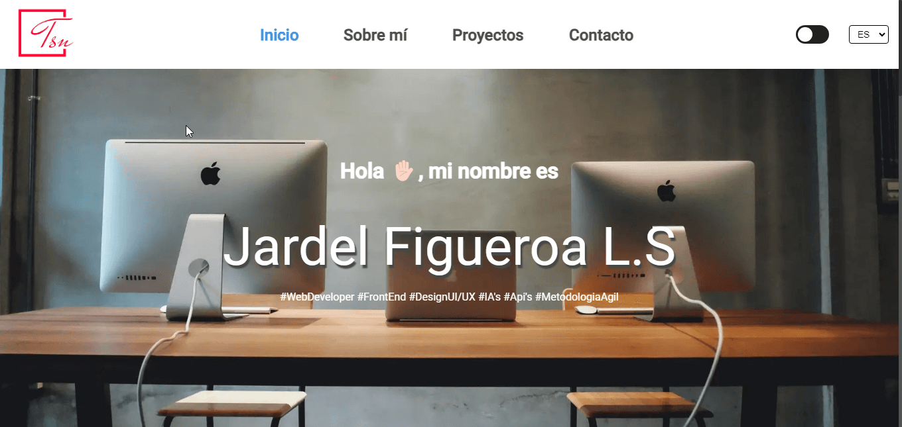

# 🌐 Portafolio de Jardel FG

¡Hola! Este es mi portafolio personal como desarrollador web. Aquí muestro algunos de mis proyectos, habilidades y experiencia profesional.

---

## 🚀 Tecnologías utilizadas

- Angular
- TypeScript
- HTML & CSS
- SCSS
- i18n con `@ngx-translate/core`
- Responsive Design
- Git & GitHub

---

## 📸 Vista previa



---

## 🧩 Estructura del proyecto

```
src/
├── app/
│   ├── core/
│   ├── shared/
│   ├── features/
│   └── components/
├── index.html
└── main.ts
```

## 🌍 Internacionalización

Este proyecto soporta múltiples idiomas gracias a [`@ngx-translate/core`](https://github.com/ngx-translate/core).  
Actualmente disponibles:
- Español (es)
- Inglés (en)

---

## 📦 Instalación

```bash
git clone https://github.com/tuusuario/tu-portafolio.git
cd tu-portafolio
npm install
ng serve
